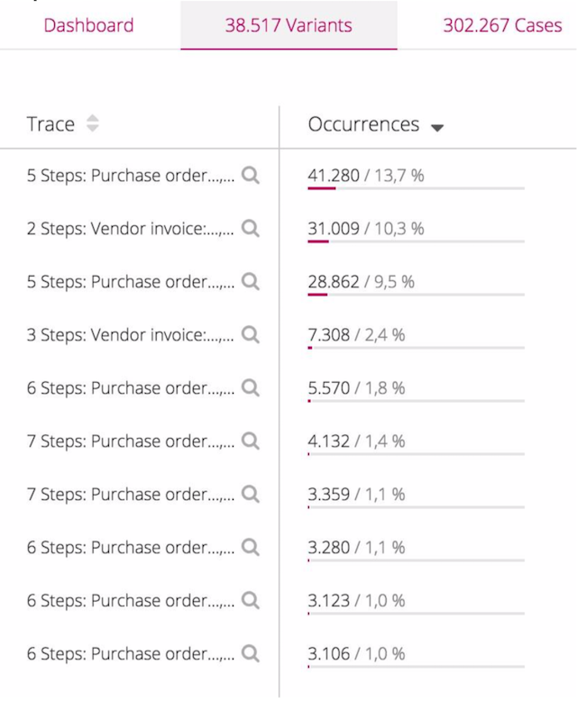

# Signavio Backend Coding Challenge
Thank you for your interest in working with Signavio! After your first interview with us, we would like to get to know your approach to problem solving in this coding challenge.

This challenge is actually closely related to the requirements of one of our products: Process Intelligence. This product enables Signavio customers to analyse big data generated from their processes and lets them recognize the gaps and variants from the intended business process (to-be) and the operating technical processes (as-is). Find out more about Process Intelligence [here](https://www.signavio.com/products/process-intelligence/)!

---
### Special Section: are you just starting your career? (a.k.a. "Junior" seniority or similar)

We're happy with your decision of applying for a role at Signavio. And we understand how intimidating this can feel. This might be one of your first coding challenges – we appreciate that and we're here for you!

There are a couple things that we would like you to be aware:

#### Junior Candidates: ✅ You're not expected to fully solve the coding challenge
Maybe some of the tasks (maybe all of them?) are above your current level of knowledge. That is ok! The acceptance criteria does not apply to your submission. 
When you come to the Technical Interview (it is scheduled after you submit your coding challenge) we will ask you questions around it. We want to understand your reasoning process... what did you try to do? Did you Google something? What did you google and why?

#### Junior Candidates: 🤔 You're allowed and welcomed to ask questions
One of the most important parts of the job of any engineer is clarifying unclear expectations. We do our best to be explicit and clear in the instructions of the coding challenge but there's always room for improvement. If one of the instructions or requests is not clear to you, please feel free to ask our Talent Acquisition team for clarifications. You're not going to be perceived "negatively" because of that at all. You might even end up helping us making it better for the next candidates!

#### Recap: 🧠 for Junior roles, it is all about the mindset
We want to know how you think, how you approach problems, how do you work your way around them. This is the purpose of this coding challenge. If you solve it... great! If you don't... that might not be an issue! Let's talk about it during your Technical Interview

---

## The Goal
Please solve the challenge below by meeting the specified acceptance criteria. When you are done, please create a pull request with your solution in this private GitHub repository. Please do not publish our coding challenge or your code to any public GitHub repository or anywhere else!

In general, do not hesitate to make assumptions and enjoy the challenge!
Please ensure that you concentrate your time on explaining and elaborating your thought process, assumptions, decisions, thoughts and comments, for example in a [thought-process.md](thought-process.md) file. Please also document how to build and run your code.

### Questions

If you have any questions about this challenge, please reach out to the assigned reviewer who was tagged in the email you received.

## Tech Stack

* Programming language: Java, Kotlin, Rust or TypeScript
* Build system: Gradle (for Java or Kotlin), Cargo (for Rust) or Node.js/NPM (for TypeScript)
* No external databases, do all calculations in memory to avoid complexity

Choose one of the languages for completing the challenge, picking what you are most comfortable with and/or what is most relevant for the job you are applying for.

## Problem Description
A Signavio customer, a multinational company that manufactures industrial appliances, has an internal system to procure (purchase) all resources the company needs to operate. The procurement is done through the company's own ERP (Enterprise Resource Planning) system.

A typical business process represented by the ERP system is _procure-to-pay_, which generally includes the following activities:
* create purchase request
* request approved
* create purchase order
* select supplier
* receive goods
* pay invoice

Whenever the company wants to buy something, they do so through their ERP system.

The company buys many resources, always using their ERP system. Each resource purchase can be considered a case, or single instance of this process. As it happens, the actual as-is process often deviates from the ideal to-be process. Sometimes purchase requests are raised but never get approved, sometimes a supplier is selected but the goods are never received, sometimes it simply takes a long time to complete the process, and so on. We call each unique sequence of activities a variant.

The customer provides us with extracted process data from their existing ERP system. The customer extracted one of their processes for analysis: Procure-to-pay. The logfiles contain three columns:
* activity name
* case id
* timestamp

We want to analyse and compare process instances (cases) with each other. You can find the sample data set [here](samples/Activity_Log_2004_to_2014.csv).

## Acceptance Criteria (please see adjusted expectations for "Juniors" above)
* Aggregate cases that have the same event execution order and list the 10 variants with the most cases.
* Provide your output as JSON, choose a structure that makes sense.
* As that output is used by other highly interactive components, we need to be able to get the query results in well under 50 milliseconds.
    * _Note_: Functionality & testing are more important to us - you should focus on this requirement last.

## How to Start

### Java/Kotlin
We have provided a simple Gradle project for Java or Kotlin, which you can find in the directory [jvm](jvm/).
For your convenience, the project already contains [code to parse the sample data CSV](jvm/jvm-shared/src/main/java/com/signavio/).
We have also provided main classes for [Java](jvm/app-java/src/main/java/com/signavio/App.java) and [Kotlin](jvm/app-kotlin/src/main/kotlin/com/signavio/App.kt) which you can use as a starting point to add your code to solve this coding challenge.

### Typescript
We have provided a simple Node.js/NPM project for TypeScript, which you can find in the directory [node-typescript](node-typescript/).
For your convenience, the project already contains [code to parse the sample data CSV](node-typescript/src/event-log-parser.ts).
We have also provided a [main script](node-typescript/src/main.ts) which you can use as a starting point to add your code to solve this coding challenge.

## How to Submit your Solution
1. Please create a [pull request](https://docs.github.com/en/free-pro-team@latest/github/collaborating-with-issues-and-pull-requests/creating-a-pull-request) with your solution when it is ready for review.
2. Please let us know by responding via email once you have created the pull request.

Thank you!

## Hints / FAQ
* The sample data set is not sorted, please use the timestamp in the last column to ensure the correct order.
* You might find duplicated activities in the sample data set. Please make an educated guess, how you would handle these duplicates and document it in the thought process file.
* The time required to read the CSV file is not considered part of the 50 milliseconds specified in the acceptance criteria.
* Test code where you feel it makes sense.
* Keep your solution simple, a CLI app is absolutely fine.
* In this document and in the provided code scaffold _activity_ and _event_ are used synonymously.

## Example

